# 1. Unidad didática 1: Elementos del desarrollo de software

## 1.1. Introducción: un poco de historia

La aparición de la informática en la década de los 50 da origen no sólo a una nueva forma de tratar la información, sino que genera un cambio radical en la sociedad creando una nueva cultura, que no sólo se basa en la informática como ciencia, sino que comienza a depender íntimamente de ella, permitiendo avances tecnológicos jamás soñados.

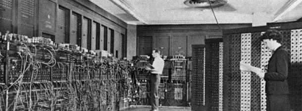

*Ilustración 1*: Eniac 1 (en torno a 1950)

A pesar de que los conocimientos adquiridos y los adelantos conseguidos han sido elevadísimos después de largos años de estudio en este campo, el ordenador sigue siendo una máquina **tonta** incapaz de actuar o realizar tareas por sí misma sin la ayuda del razonamiento humano (poco a poco la inteligencia artificial está superando esto).

Un ordenador es una máquina constituida por un conjunto de componentes físicos la mayoría de origen electrónico, utilizado principalmente para procesar datos de forma rápida y eficaz. El comportamiento de todo ordenador se rige por secuencia de instrucciones que recibe a través de **programas** o **aplicaciones**.

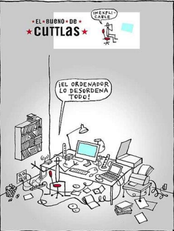

*Ilustración 2*: Paradojas informáticas

El hombre es quien marca las pautas para su correcto funcionamiento a través de la lógica y el razonamiento. La potencia y capacidad de cálculo de un ordenador dependerá básicamente de su **eficacia, fiabilidad, rapidez y precisión**, así como de la **memoria disponible**. Pero también de la calidad del código programado.

En definitiva, un ordenador es una simple máquina capaz de aceptar datos de entrada, procesarlos y facilitar datos o resultados de salida.

## 1.2. Programa y aplicación informática

Seguro que alguna vez hemos usado el ordenador para escribir un texto o para entretenernos (demasiado tiempo) con algún juego. Para hacerlo hemos tenido que poner en marcha el procesador de texto o el juego en cuestión. Pues bien, las dos cosas son programas de ordenador.

Poner un programa en marcha es sinónimo de **ejecutarlo**. Cuando ejecutamos un programa sólo vemos los resultados pero no el guión seguido por el ordenador para conseguir esos resultados. **Este guión es realmente el programa**.

A partir de ahora, seremos nosotros los que escribiremos el guión, es decir, sabremos cómo trabaja y por qué trabaja de esa forma. Vamos a pasar de ser usuarios (que utilizan) a programadores (que crean).

Si queremos enseñar a alguien a jugar a un juego de ordenador, le explicamos qué tiene que hacer, las normas y pasos a seguir. Básicamente esto es lo que hace un programa de ordenador. Un programa es una serie de instrucciones dadas al ordenador en un lenguaje entendido por él para decirle exactamente lo que queremos que haga. Si el ordenador no entiende alguna instrucción nos lo comunicará mediante
mensajes visualizados por pantalla.

Los pasos a seguir en la realización de un programa, una vez que ya tenemos claro qué queremos hacer (o hemos solucionado el problema que queremos solventar con un programa), son los siguientes:

* Editar el programa. (Escribir el código).
* Compilarlo.
* Ejecutarlo.
* Depurarlo

Por lo general, un programa no es capaz de ejecutarse por sí mismo, sino que necesita de otros programas externos que lo complementen. Este complemento se llama **librería**, y puede ser un programa o simplemente un conjunto de código que realice tareas concretas (por ejemplo, para tratamiento de cadenas de caracteres).

Para todo ello, usaremos herramientas que facilitan el trabajo llamadas **Entornos de Desarrollo Integrado (IDE)**, y que serán objeto de estudio en este módulo.

Más formalmente, podríamos dar las siguientes definiciones:

> Un **programa informático** es un **conjunto de instrucciones** diseñadas y creadas a través del **razonamiento lógico** y que son **almacenadas** en ficheros de texto respetando la **sintaxis** de
un determinado lenguaje de programación.

> Una **aplicación informática** es el **conjunto** de uno o más **programas enlazados** o relacionados entre sí, junto con la **documentación** generada durante el proceso de desarrollo de dicha aplicación.

> Un **sistema** es **el conjunto de elementos** relacionados entre sí **para la consecución** de un determinado **fin**.

## 1.3. Lenguajes de programación

### 1.3.1. Definición de lenguaje

Para realizar las operaciones y acciones, el procesador del ordenador necesita recibir instrucciones, que por lo general son indicadas como un código binario. Estas instrucciones están escritas en el llamado lenguaje o código máquina.

Al estar codificado en binario, el lenguaje máquina no es comprensible para los seres humanos, razón por la cual se han desarrollado lenguajes intermediarios comprensibles para el hombre. El código escrito en este tipo de lenguaje se transforma en código máquina para que el procesador pueda procesarlo.

> Un **lenguaje de programación**, está formado por un **conjunto de símbolos y reglas sintácticas** y semánticas que definen su estructura y el significado de sus elementos y expresiones, permitiendo **especificar de manera precisa** sobre qué datos debe operar una computadora, cómo deben ser almacenados o transmitidos y qué acciones debe tomar bajo una variada gama de circunstancias. 

Su principal característica es que todo esto se realiza a través de un lenguaje que intenta estar relativamente próximo al lenguaje humano o natural. Una característica relevante de los lenguajes de programación es, precisamente, que más de un programador pueda usar un conjunto común de instrucciones que sean comprendidas entre ellos para realizar la construcción de un programa de forma colaborativa.

Al proceso por el cual se escribe, se prueba, se depura, se compila y se mantiene el código fuente de un programa informático se le llama programación.

### 1.3.2. Elementos de un lenguaje de programación

Al igual que en el lenguaje natural de las personas, cualquier lenguaje de programación queda definido por ciertos elementos y reglas que permiten describir de los datos y de los procesos o transformaciones aplicadas a estos datos (tal como la suma de dos números o la selección de un elemento que forma parte de una
colección). Estos elementos son definidos por reglas sintácticas y semánticas que describen su estructura y significado respectivamente.

A la forma visible de un lenguaje de programación se le conoce como **sintaxis**. La mayoría de los lenguajes de programación son puramente textuales, es decir, utilizan secuencias de texto que incluyen palabras, números y puntuación, de manera similar a los lenguajes naturales escritos. 

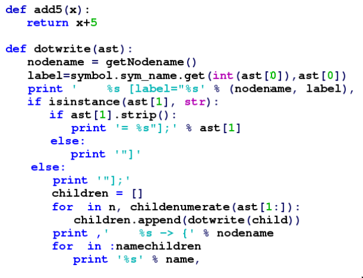

*Ilustración 3*. Código Python, con la sintaxis resaltada en colores.

> La **sintaxis** de un lenguaje de programación describe las **combinaciones posibles** de los **símbolos** que forman un programa sintácticamente correcto.
> El **significado** que se le da a una combinación de símbolos es manejado por su **semántica**.

No todos los programas sintácticamente correctos son semánticamente correctos. Muchos programas sintácticamente correctos tienen inconsistencias con las reglas del lenguaje; y pueden (dependiendo de la especificación del lenguaje y la solidez de la implementación) resultar en un error de traducción o ejecución. En algunos casos,
tales programas pueden exhibir un comportamiento indefinido. Además, incluso cuando un programa está bien definido dentro de un lenguaje, todavía puede tener un significado que no es el que la persona que lo escribió estaba tratando de construir.

Usando el lenguaje natural, por ejemplo, puede no ser posible asignarle significado a una oración gramaticalmente válida o la oración puede ser falsa:

* “Las ideas verdes y descoloridas duermen furiosamente” es una oración bien formada gramaticalmente pero no tiene significado comúnmente aceptado.
* “Juan es un soltero casado” también está bien formada gramaticalmente pero expresa un significado que no puede ser verdadero.

### 1.3.3. Tipos de lenguajes de programación

Un lenguaje de programación es, por definición, diferente al lenguaje máquina, por lo que deben traducirse para que el procesador pueda comprenderlo. Según la forma en la que se haga está traducción, los lenguajes de programación pueden dividirse en dos
categorías:

* **lenguajes interpretados**: Un programa escrito en un lenguaje interpretado requiere de un programa auxiliar (el intérprete), que traduce los comandos de los programas según sea necesario.
* **lenguajes compilados**: Un programa escrito en un lenguaje “compilado” se traduce a través de un programa anexo llamado compilador que, a su vez, crea un nuevo archivo independiente que no necesita ningún otro programa para ejecutarse a sí mismo. Este archivo se llama ejecutable.

Un programa escrito en un lenguaje compilado posee la ventaja de no necesitar un programa anexo para ser ejecutado una vez que ha sido compilado. Además, como sólo es necesaria una traducción, la ejecución se vuelve más rápida.

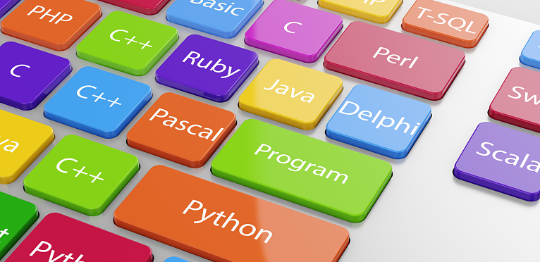

*Ilustración 4*. Lenguajes de programación más utilizados

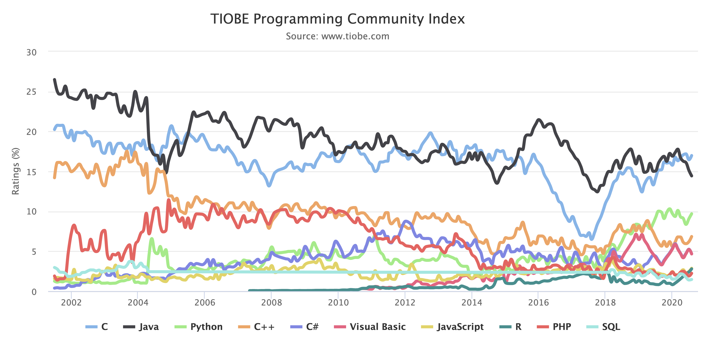

*Ilustración 5*. Índice TIOBE de lenguajes de programación más utilizados, actualizado a Julio de 2019.

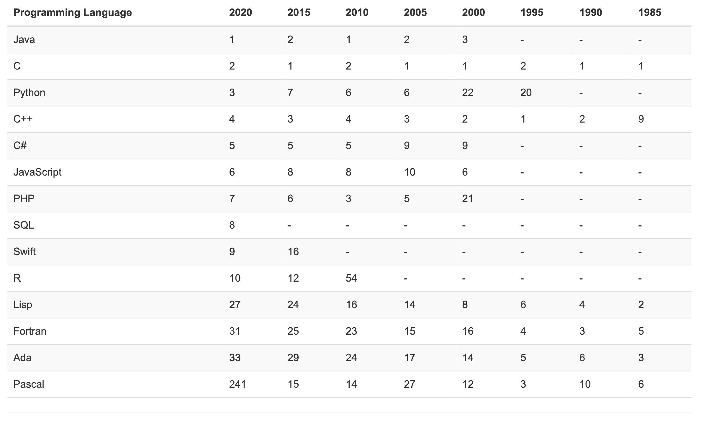

*Ilustración 6*. Listado de los lenguajes de programación más utilizados, según el índice TIOBE, en los últimos años.

> Puedes visitar este índice [aquí](https://www.tiobe.com/tiobe-index/).

Sin embargo, no es tan flexible como un programa escrito en lenguaje interpretado, ya que cada modificación del archivo fuente (el archivo comprensible para los seres humanos: el archivo a compilar) requiere de la compilación del programa para aplicar
los cambios.

Por otra parte, un programa compilado tiene la ventaja de garantizar la seguridad del código fuente. En efecto, el lenguaje interpretado, al ser directamente un lenguaje legible, hace que cualquier persona pueda conocer los secretos de fabricación de un
programa y, de ese modo, copiar su código o incluso modificarlo. Por lo tanto, existe el riesgo de que los derechos de autor no sean respetados. Por otro lado, ciertas aplicaciones aseguradas necesitan confidencialidad de código para evitar las copias
ilegales (transacciones bancarias, pagos en línea, comunicaciones seguras...).

Por último, algunos lenguajes pertenecen a ambas categorías dado que el programa escrito en estos lenguajes puede, en ciertos casos, sufrir una fase de compilación intermediaria, en un archivo escrito en un lenguaje ininteligible (por lo tanto diferente al
archivo fuente) y no ejecutable (requeriría un intérprete).

Como veremos más adelante, éste es el caso de Java, en el que se realiza un doble proceso de compilación e interpretación.

### 1.3.4. Tipos de código generados por un lenguaje de programación

A lo largo de la unidad se han ido nombrando distintos conceptos como código fuente y código ejecutable. Todos ellos son distintas fases del código que se genera por un lenguaje de programación, y se corresponde con distintas fases de la elaboración de
un programa.

> **Código fuente** es el código escrito por un programador en un determinado lenguaje de programación, definiendo el conjunto de instrucciones que debe realizar la computadora. 

Este código fuente, comprensible por el ser humano ya que ha sido escrito siguiendo unas reglas definidas por él mismo, debe ser traducido al lenguaje máquina del procesador. Este proceso de traducción se llama **compilación** y el resultado de dicho proceso es el **código objeto**.

> **Código objeto** es el código máquina generado tras compilar un determinado código fuente. 

Por lo general, una aplicación informática está formada por un conjunto de programas, cada uno de los cuales realiza una operación concreta además de una serie de librerías de código. Por tanto, para poder ejecutar una aplicación es necesario enlazar y combinar los códigos objeto de cada programa y las librerías necesarias, obteniendo un **archivo ejecutable**.

*Ilustración 7*. Proceso de obtención de una aplicación.

> Un **archivo ejecutable** es un programa completo, que puede ser ejecutado por el ordenador, obtenido después de enlazar varios códigos objetos y librerías.

### 1.3.5. Paradigmas de programación

Un paradigma (método o modelo) de programación determina la visión y métodos de un programador en la construcción de un programa o subprograma, se puede decir también que son diferentes formas de pensar la solución de problemas. Ejemplos de paradigmas de programación son los siguientes:

* Imperativo
* Declarativo
* Estructurado
* Orientado a objetos
* Funcional
* Lógico

En este curso nos centraremos en dos de estos paradigmas: la programación estructurada y la programación orientada a objetos.

### 1.3.6. La programación estructurada

Es un estilo de programación con el cual el programador elabora programas, cuya
estructura es **la más clara posible**, mediante el uso de tres estructuras básicas de
control lógico:

* Secuencia
* Selección
* Iteración.

> La programación estructurada tiene un teorema fundamental: Cualquier programa puede
ser elaborado utilizando **únicamente** las tres estructuras básicas (secuencia, selección,
iteración).

Entre las **ventajas** de la programación estructurada, se encuentran las siguientes:

* *Programas más fáciles de entender*. La estructura del programa es más clara puesto que las instrucciones están más ligadas o relacionadas entre sí, por lo que es más fácil comprender lo que hace cada función.
* *Reducción del esfuerzo en las pruebas*. Los errores se pueden detectar y reparar más fácilmente.
* *Reducción de los costos de mantenimiento*.
* *Programas más sencillos y más rápidos*.
* *Aumento en la productividad del programador*.
* Los programas quedan *mejor documentados* internamente.

Por el contrario, la programación estructurada acarrea algunos **inconvenientes**. El principal es que se obtiene un **único bloque** de programa, que cuando se hace demasiado grande puede resultar problemático en cuanto a su manejo, esto se resuelve empleando la **programación modular**.

### 1.3.7. La programación orientada a objetos

La programación orientada a objetos se caracteriza por la idea central, **el objeto**. Podemos decir que ***cualquier cosa, en serio, cualquier cosa***, que nos rodea es un objeto (cada mesa, cada compañero, cada monitor,...).

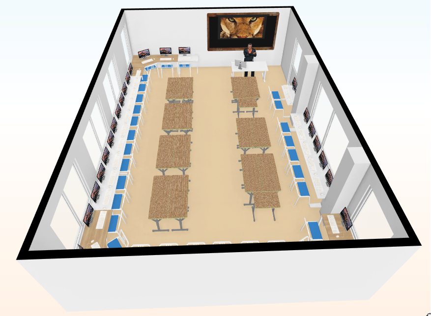

*Ilustración 8*. Cualquier cosa sobre la que podemos emitir un concepto es un objeto: mesas, sillas, ordenadores, personas, ...

Las características fundamentales de este enfoque son las siguientes:

* Existe la posibilidad de ***representar directamente las entidades del mundo real*** en los escenarios informáticos, sin necesidad de deformarlas. 
* Se facilita enormemente la ***reutilización y modificación del software***.
* Se puede ***trabajar en equipo***, desarrollando en paralelo módulos para una aplicación con un esfuerzo mínimo en coordinación.

Existen una **serie de pasos** que sirven de guía a la hora de modelar un sistema empleando orientación a objetos:

1. Identificar los *objetos* que intervienen en él.
2. Agrupar en *clases* a todos aquellos objetos que tengan características y comportamiento comunes.
3. Identificar los *datos y operaciones** de cada una de las clases.
4. Identificar las *relaciones* que puedan existir entre las clases.

La programación orientada a objetos presenta ciertas características que la hacen destacar y al mismo tiempo la diferencian de la programación estructurada o modular, alguna de las cuales se describen a continuación:

* **Protección de la información**: El encapsulamiento (como las cápsulas de los medicamentos) de datos y procedimientos
junto con unos niveles de acceso a la información forman unos límites que proporcionan una gran protección a la información contenida en el objeto (permisos para que os lean el correo).
* **Rápido desarrollo**: La posibilidad de volver a usar objetos (reutilización objetos) ya definidos y probados en otros programas, disponibles en librerías, permite que el desarrollo de programas se realice con gran rapidez.
* **Fácil mantenimiento**: En el caso de una modificación o mejora de una aplicación desarrollada con objetos, las características de la programación orientada a objetos, permiten que se realice con una gran facilidad, pues se reduce a modificar los componentes de algunos objetos o a crear nuevos objetos aprovechando los ya existentes, haciendo que hereden sus características.

Otra característica fundamental de la POO es el **polimorfismo y la herencia**. Esta característica está basada en la posibilidad de definir objetos genéricos en base a una serie de propiedades comunes, permitiendo concretar más adelante dicho objeto
genérico. Por ejemplo, se puede definir el objeto _Vehículo_ y, a partir de éste, definir los objetos _Coche, Barco, Tren, Bicicleta, Avión_,...

*Ilustración 9*. Ejemplo de herencia y polimorfismo.

La base de la POO está en la definición de _Clases y Objetos_. Una **clase** es la definición genérica de un tipo de objeto, definiendo sus propiedades y su comportamiento. Mientras que un **objeto** es la realización concreta (o **instancias**) de una clase. Por ejemplo, podemos definir la clase _Humano_ como un ser vivo, que tiene género, altura, peso, color de pelo,… Para dicha clase Humano, podremos definir todas las personas que queramos.

*Ilustración 10*. Instanciación de una clase en objetos.

Para finalizar, diremos que un modelo de objetos es **más cercano a la realidad** que un modelo funcional. Además, el modelo orientado a objetos **facilita la integridad de módulos** que han sido realizados por separado para no correr riesgos en el manejo de los datos.

## 1.4. El lenguaje de programación Java

### 1.4.1. Historia del lenguaje Java

> _"Lo que Java intenta hacer, y lo hace con bastante éxito, es abarcar bastantes dominios diferentes. De esa forma le permite efectuar trabajos para App server, trabajos para teléfonos móviles, programación científica, puede escribir software, realizar navegación interplanetaria, cualquier cosa…”_ (James Gosling, creador de Java)

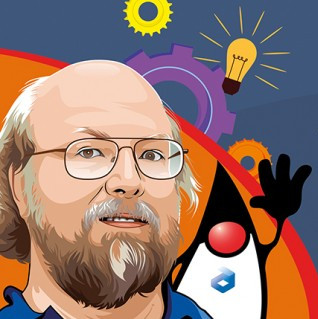

*Ilustración 11*. James Gosling, creador de Java; y _Duke_, [mascota de Java](https://www.oracle.com/java/duke.html).

James Gosling y otros desarrolladores de Sun Microsystems estaban trabajando en un proyecto de TV interactiva (y programando electrodomésticos como microondas y calculadoras) a mediados de los 90, cuando James llegó a frustrarse con el lenguaje
que estaban usando (C++), un lenguaje desarrollado 10 años antes como una extensión de C para poder usar orientación a objetos.

James se encerró (Java se creó en 18 meses) en su oficina y creó un nuevo lenguaje que mejoraba las cosas que no le gustaban de C++. El proyecto de la TV interactiva fracasó, pero su lenguaje tuvo una imprevista aplicabilidad en un nuevo medio que se
hacía popular al mismo tiempo: la Web.

Inicialmente Java se llamó Oak (roble en inglés), aunque tuvo que cambiar de denominación, debido a que dicho nombre ya estaba registrado por otra empresa. Se dice, que este nombre se le puso debido a la existencia de tal árbol en los alrededores
del lugar de trabajo de los promotores del lenguaje. 

Java fue lanzado por Sun en el otoño de 1995. Tres de las principales razones que llevaron a crear Java son:

* Creciente necesidad de **interfaces mucho más cómodas** e intuitivas que los sistemas de ventanas que proliferaban hasta el momento.
* **Fiabilidad del código y facilidad de desarrollo**. Gosling observó que muchas de las características que ofrecían C o C++ aumentaban de forma alarmante el gran coste de pruebas y depuración. Por ello en los sus ratos libres creó un lenguaje de programación donde intentaba solucionar los fallos que encontraba en C++.
* Enorme **diversidad de controladores electrónicos**. Los dispositivos electrónicos se controlan mediante la utilización de microprocesadores de bajo precio y reducidas prestaciones, que varían cada poco tiempo y que utilizan diversos conjuntos de instrucciones. Java permite escribir un código común para todos los dispositivos.

Por todo ello, en lugar de tratar únicamente de optimizar las técnicas de desarrollo y dar por sentada la utilización de C o C++, el equipo de Gosling se planteó que tal vez los lenguajes existentes eran demasiado complicados como para conseguir reducir de
forma apreciable la complejidad de desarrollo asociada a ese campo. Por este motivo, su primera propuesta fue idear un nuevo lenguaje de programación lo más sencillo posible, con el objeto de que se pudiese adaptar con facilidad a cualquier entorno de
ejecución.

Basándose en el conocimiento y estudio de gran cantidad de lenguajes, este grupo decidió recoger las características esenciales que debía tener un lenguaje de programación moderno y potente, pero eliminando todas aquellas funciones que no eran absolutamente imprescindibles.

En diciembre de 1998, Sun anuncia el Java 2 como marca comercial de la versión JDK 1.2. Sun, la empresa que desarrollaba Java fue adquirida por Oracle en 2010.

A lo largo de muchos años, el lanzamiento de nuevas versiones de Java se ha hecho en espacios largos de tiempo (entre 2 y 5 años). 

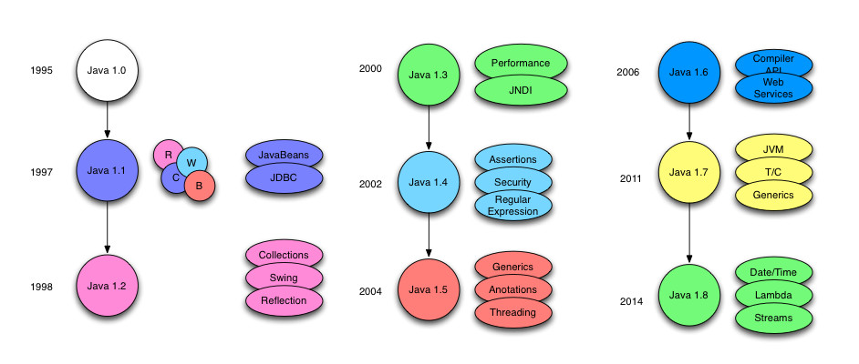

*Ilustración 12*. Versiones de Java hasta Java 8 (gracias a [https://www.arquitecturajava.com/las-versiones-de-java/](https://www.arquitecturajava.com/las-versiones-de-java/)).

En septiembre de 2017 se libera la versión 9 de Java, y a partir de ahí, se pasa a liberar nuevas versiones por calendario, y no _por funcionalidades. Cada 6 meses se libera una nueva versión de Java, siendo alguna de ellas una versión LTS (_long term support_) para garantizar compatibilidad durante un período aceptable de tiempo.

A día de hoy, la última versión pendiente de liberar es Java 13, y la última LTS liberada es la 11, si bien una de las más utilizadas sigue siendo la 8.

### 1.4.2. Características del lenguaje Java

* **Lenguaje Simple**: Java posee una curva de aprendizaje muy rápida. Resulta relativamente sencillo escribir programas interesantes desde el principio. Todos aquellos familiarizados con C++ encontrarán que Java es más sencillo, ya que
se han eliminado ciertas características, como los punteros. Debido a su semejanza con C y C++, y dado que la mayoría de la gente los conoce aunque sea de forma elemental, resulta muy fácil aprender Java. Los programadores
experimentados en C++ pueden migrar muy rápidamente a Java y ser productivos en poco tiempo.
* **Orientado a objetos**: Java fue diseñado como un lenguaje orientado a objetos desde el principio. Los objetos agrupan en estructuras encapsuladas tanto sus datos como los métodos (o funciones) que manipulan esos datos. Una de la tendencias más ampliamente extendidas, a la que Java se suma, apunta hacia la programación orientada a objetos, especialmente en entornos cada vez más complejos y basados en red.
* **Distribuido**: Java proporciona una colección de clases para su uso en aplicaciones de red, que permiten abrir sockets y establecer y aceptar conexiones con servidores o clientes remotos, facilitando así la creación de aplicaciones distribuidas.
* **Compilado e interpretado**: Java es compilado, en la medida en que su código fuente se transforma en una especie de código máquina, los _bytecodes_, semejantes a las instrucciones de ensamblador. Por otra parte, es interpretado, ya que los bytecodes se pueden ejecutar directamente sobre cualquier máquina a la cual se hayan portado el intérprete y el sistema de ejecución en tiempo real (runtime).
* **Robusto**: Java fue diseñado para crear software altamente fiable. Para ello proporciona numerosas comprobaciones en compilación y en tiempo de ejecución. Sus características de memoria liberan a los programadores de una familia entera de errores (la aritmética de punteros), ya que se ha prescindido por completo los punteros, y la recolección de basura elimina la necesidad de liberación explícita de memoria.
* **Seguro**: Dada la naturaleza distribuida de Java, donde las applets se bajan desde cualquier punto de la Red, la
seguridad se impuso como una necesidad de vital importancia. A nadie le gustaría ejecutar en su ordenador programas con acceso total a su sistema, procedentes de fuentes desconocidas. Así que se implementaron barreras de seguridad en el lenguaje y
en el sistema de ejecución en tiempo real.
* **Independiente a la arquitectura**: Java está diseñado para soportar aplicaciones que serán ejecutadas en los más variados entornos de red, desde Unix a Windows, pasando por Mac y estaciones de trabajo, sobre arquitecturas distintas y con sistemas operativos diversos. Para acomodar requisitos de ejecución tan variopintos, el compilador de Java genera bytecodes: un formato
intermedio indiferente a la arquitectura, diseñado para transportar el código eficientemente a múltiples plataformas
hardware y software. El resto de problemas los soluciona el intérprete de Java. 
* **Portable**: La indiferencia a la arquitectura representa sólo una parte de su portabilidad. Además, Java especifica los
tamaños de sus tipos de datos básicos y el comportamiento de sus operadores aritméticos, de manera que los programas
son iguales en todas las plataformas. Estas dos últimas características se conocen como la _Máquina Virtual Java (JVM)_.
* **Multihilo**: Hoy en día ya se ven como terriblemente limitadas las aplicaciones que sólo pueden ejecutar una acción a la vez. Java soporta sincronización de múltiples hilos de ejecución (_multithreading_) a nivel de lenguaje, especialmente útiles en la creación de aplicaciones de red distribuidas. Así, mientras un hilo se encarga de la comunicación, otro puede interactuar con
el usuario mientras otro presenta una animación en pantalla y otro realiza cálculos.
* **Dinámico**: El lenguaje Java y su sistema de ejecución en tiempo real son dinámicos en la fase de enlazado. Las clases sólo se enlazan a medida que son necesitadas. Se pueden enlazar nuevos módulos de código bajo demanda, procedente de fuentes muy variadas, incluso desde la Red.

### 1.4.3. La máquina virtual de Java (JVM)

Tal y como se ha dicho en el apartado anterior, Java es un lenguaje doblemente compilado e interpretado, lo que lo convierte en un lenguaje altamente portable y compatible con cualquier tipo de hardware.

*Ilustración 13*. Java es doblemente compilado e interpretrado.

El código fuente en Java se escribe en ficheros que tienen la extensión .java. Por lo general, se escribe un fichero de código fuente por cada clase definida para el programa.

Este código fuente es compilado para obtener código objeto en ficheros con la extensión _.class_ (se obtiene un fichero _.class_ por cada _.java_). Este código objeto está escrito en un lenguaje cercano al código máquina, llamado ***bytecode***. La principal
ventaja de este paso es que el bytecode obtenido para una clase es siempre igual, independientemente de la máquina en la que se pretenda ejecutar.

La portabilidad e independencia de máquina o sistemas operativos, se obtiene a través de la máquina virtual de java (Java Virtual Machine, JVM). Esta “máquina” es un software necesario para poder ejecutar cualquier aplicación escrita en java y es el
encargado de traducir el bytecode en lenguaje máquina, ya adaptado a la máquina concreta sobre la que se está ejecutando. Por tanto, será necesario instalar la JVM apropiada al S.O. del dispositivo.

## 1.5. Fases en el desarrollo de una aplicación

### 1.5.1. Metodología para el desarrollo de software

Imaginemos que quiero construirme una casa. ¿Qué pensarías de mí si empezara a poner ladrillos sin antes haber hecho un estudio del suelo, materiales, recursos, y sin haber hecho un diseño previo? Pues lo mismo que se puede pensar de la gente que se pone a programar sin seguir una metodología de programación, que haberla la hay.

El proceso de construcción del software requiere, como cualquier otra ingeniería, identificar las tareas que se han de realizar sobre el software y aplicar esas tareas de una forma ordenada y efectiva. Adicionalmente, el desarrollo del software se debe realizar por un conjunto coordinado de personas simultáneamente, y por lo tanto sus esfuerzos deben estar dirigidos por una misma metodología que permita estructurar las diferentes fases del desarrollo.

En la literatura sobre este tema existen muchas definiciones sobre lo que es una metodología. Más o menos todas ellas coinciden en que debería tener al menos las siguientes características:

* Define como se divide un proyecto en fases y las tareas a realizar en cada una.
* Para cada una de las fases está especificado cuales son las entradas que reciben y las salidas que producen.
* Tienen alguna forma de gestionar el proyecto.

Teniendo esto en cuenta establecemos la siguiente definición:

> Una **metodología** es un modo sistemático de producir software.

A la hora de realizar una aplicación informática, es muy importante seguir una metodología, siempre que se quiera ahorrar en dos elementos fundamentales: en tiempo y en dinero. Volviendo al ejemplo de la casa, imagina la cantidad de veces que debería volver atrás y tirar paredes ya hechas porque de pronto descubro que el suelo es inestable, la bañera no cabe, la instalación eléctrica no la había tenido en cuenta, etc. Pues, con el código pasa exactamente lo mismo.

Existen multitud de metodologías, resultando cada una de ellas más adecuada a un tipo u otro de proyectos. Una de las metodologías que han sido más utilizadas en España es Métrica v3, definida por el Ministerio de Administraciones Públicas para el desarrollo de aplicaciones informáticas en el ámbito de las administraciones públicas, aunque hoy en día se utiliza en otros muchos ámbitos. Con todo, a día de hoy se están imponiendo las conocidas como ***metodologías ágiles***, centradas en que el cliente obtenga resultados iterativos _lo más pronto posible_. Algunas de ellas son la _programación extrema (XP)_, Scrum, Kanban, ... (puedes leer un poco más sobre metodologías ágiles en [https://www.iebschool.com/blog/que-son-metodologias-agiles-agile-scrum/](https://www.iebschool.com/blog/que-son-metodologias-agiles-agile-scrum/)).

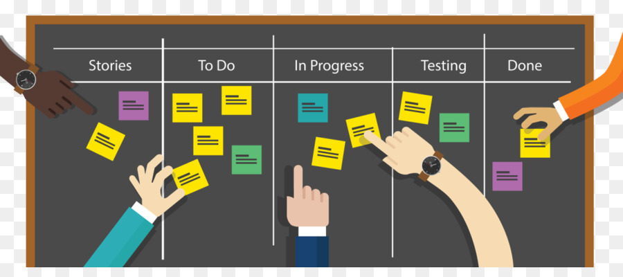

*Ilustración 14*. Un ejemplo de como organizar las tareas en una metodología ágil como Scrum.

### 1.5.2. Ciclo de vida del software 

Al igual que en otros sistemas de ingeniería, los sistemas de software requieren un tiempo y esfuerzo considerable para su desarrollo y deben permanecer en uso por un periodo mucho mayor.

Durante este tiempo de desarrollo y uso, desde que se detecta la necesidad de construir un sistema de software hasta que este es retirado, se identifican varias **etapas** que en conjunto se denominan el ciclo de vida del software.

Usualmente se consideran las etapas: especificación y análisis de requisitos, diseño del sistema, implementación del software, aplicación y pruebas, entrega y mantenimiento.

Cada fase estará definida por un conjunto de **tareas** a realizar en ella y por el producto generado antes de pasar a la siguiente etapa. Este **producto** podrá ser considerado como un entregable o no, en función de si es para entregarlo al cliente
como parte del proyecto o forma parte de la documentación interna.

Un aspecto esencial dentro de las tareas del desarrollo del software es la **documentación** de todos los elementos y especificaciones en cada fase. Cada etapa tiene como entrada uno o varios documentos procedentes de las etapas anteriores y produce otros documentos de salida.

Después de cada etapa se realiza una revisión para comprobar si se puede pasar a la siguiente.

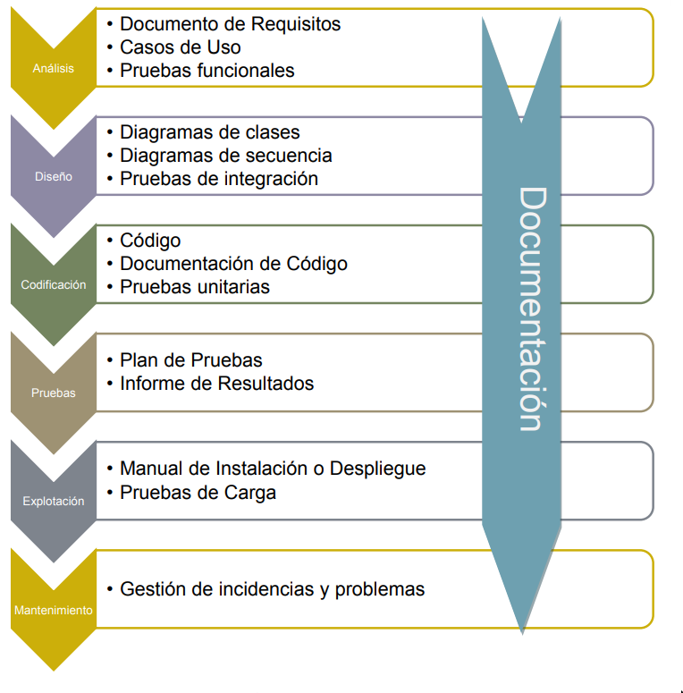

*Ilustración 15*. Ciclo de vida en cascada

### 1.5.3. Análisis

Durante esta fase, se estudia a fondo el problema que pretende resolverse, tratando de comprender necesidad del cliente y de definir las especificaciones del producto que pretende desarrollarse.

En un primer lugar, se obtendrá una descripción grosso modo, de lo que se desea obtener, definiendo los distintos usuarios (o roles) que utilizarán el sistema. Además, se describirán a grandes rasgos las principales operaciones que realizará la aplicación. Esta descripción no sigue ningún estándar y se hace de manera que el cliente pueda ir entendiendo, desde las primeras reuniones, la solución propuesta.

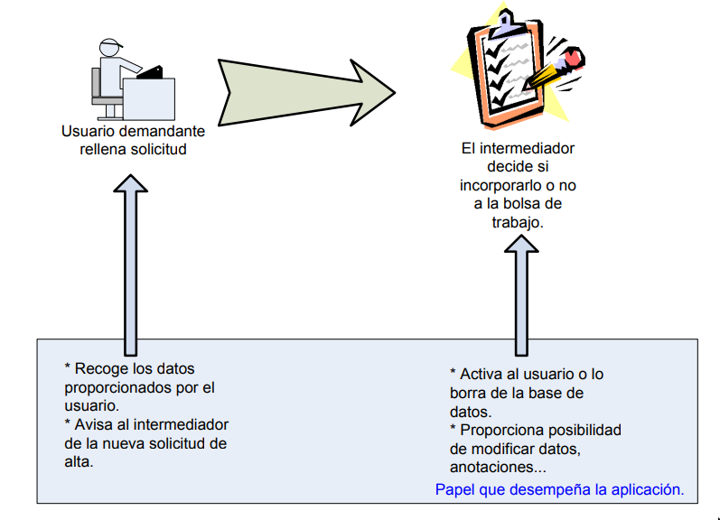

*Ilustración 15.1*. Diagrama no estándar de las primeras especificaciones

Tras esa primera descripción, el producto a desarrollar se define a través de requisitos que se van obteniendo a partir de las sucesivas reuniones con el cliente.

> Un requisito puede definirse como la capacidad que el sistema debe tener porque el cliente lo ha pedido explícita o implícitamente.

La obtención de requisitos es difícil por varias razones:

* La naturaleza de los requisitos es cambiante.
* Surgen nuevos requisitos en cualquier momento.
* El cliente puede no tenerlos claros.
* Pueden existir malos entendidos debidos a:
    * Falta de conocimientos por parte del equipo desarrollador sobre el problema.
    * Falta de conocimientos técnicos (informáticos) por parte del cliente para expresarse con claridad.

*Tabla 1*. Ejemplo de requisitos para una web de intemediación laboral.

Los requisitos se dividen en dos tipos:

* **Requisitos funcionales**: dicen qué debe hacer el sistema, en el sentido de servicios proporcionados al usuario.
* **Requisitos no funcionales**: hablan de características del sistema, como pueden ser la fiabilidad, la mantenibilidad, el sistema operativo, la plataforma hardware, el aspecto gráfico, etc.

Otros elementos importantes en la fase de análisis son los casos de uso, que constituyen otra forma de especificar los requisitos de un sistema. Un caso de uso:

* Describe la interacción entre un actor externo al sistema y el sistema con texto en lenguaje natural.
* Representa los requisitos funcionales desde el punto de vista del usuario y por lo tanto produce un resultado observable por él.
* Es iniciado por un único actor. 
* Realiza una funcionalidad concreta.

Mediante un diagrama de casos de uso podemos representar los diferentes casos de uso, las relaciones entre ellos y los actores participantes.

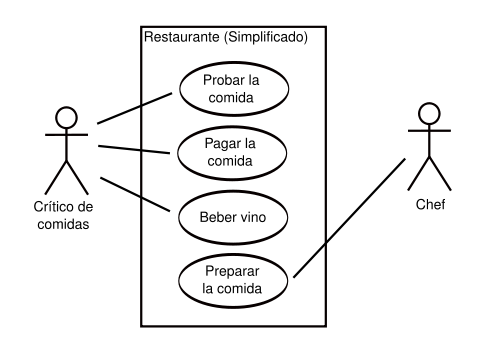

*Ilustración 15.2* Diagrama de casos de uso.

Si un caso de uso resulta demasiado complejo, podemos elaborar una ficha que nos sirva para estudiar, paso a paso, cuál es la interacción entre los diferentes actores y el sistema.

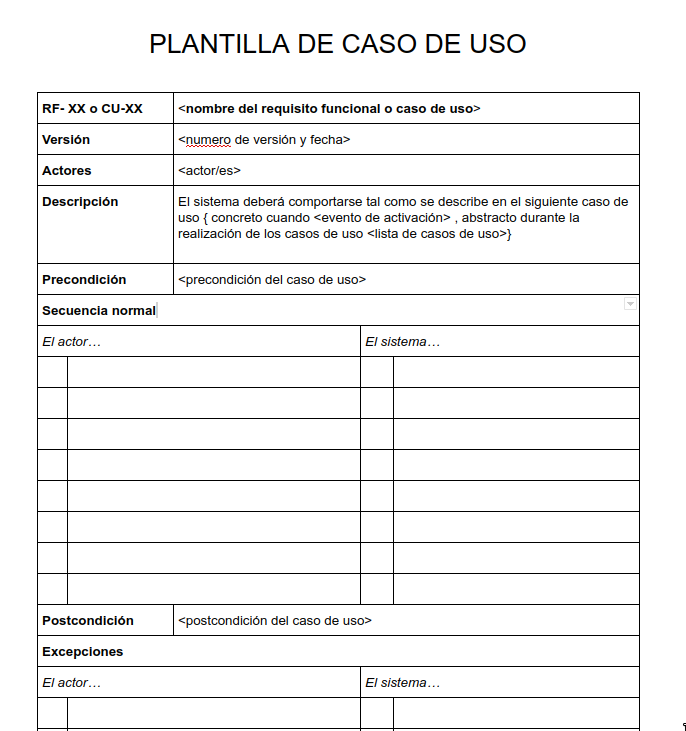

*Ilustración 15.3* Plantilla para desarrollar los casos de uso más complejos.

Un proceso clave en la fase de análisis y toma de requisitos son las **entrevistas con el cliente**, a través de las cuales se van comprendiendo sus necesidades que, posteriormente, serán traducidas a requisitos y casos de uso. El proceso habitual suele ser:

En una reunión final, se dará por cerrado el análisis, aprobando el **Documento de Análisis** que contiene todos los requisitos y casos de uso, así como las especificaciones del sistema. Este documento se entiende como un contrato por el que el equipo de desarrollo se compromete a desarrollar una aplicación que realice exactamente las tareas que se recogen en dicho documento.

Dicho de otro modo, cualquier modificación que quiera hacerse en el proyecto deberá encontrarse dentro del alcance del documento de análisis. En caso contrario, se entenderá fuera del contrato y, por tanto, no se realizará (o se renegociará el contrato).

### 1.5.4. Diseño

Una vez que se han identificado los requisitos para el problema, es necesario idear y componer la forma de la solución para el problema. Para dejar constancia de los diseños se deben utilizar lenguajes lo más formales posible, como tablas, diagramas y
pseudocódigo.

> *UML* son las siglas de **lenguaje unificado de modelado** (_unified modeling language_). Se trata de un lenguaje gráfico para visualizar, especificar, construir y documentar un sistema (en nuestro caso, un sistema software). Lo estudiaremos a lo largo del curso, aunque aquí puedes encontrar algo de información para empezar [https://es.wikipedia.org/wiki/Lenguaje_unificado_de_modelado](https://es.wikipedia.org/wiki/Lenguaje_unificado_de_modelado).

Por lo general, el producto de esta fase es el Documento de Diseño que, entre otros elementos, suele contener:

* Una descripción y un boceto del interfaz de la aplicación. En ocasiones se construyen maquetas sin funcionalidad. 
* Diagrama UML de Componentes, indicando la arquitectura del sistema y las relaciones entre los distintos subsistemas (base de datos, interfaz, etc.)
* Diagrama UML de Clases, mostrando las distintas entidades que aparecen en el modelo de datos. Si la aplicación se va a realizar siguiendo la POO, se indican las clases, con sus atributos, métodos y relaciones entre ellas.
* Diagrama UML de Secuencias, mostrando el flujo de la aplicación en los distintos casos de uso.
* Descripción de cada una de las clases que conformarán el modelo de datos.

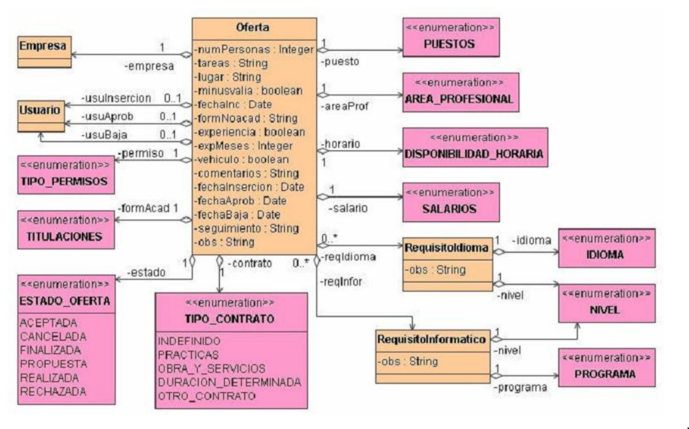

*Ilustración 16*. Ejemplo de un diagrama de clases.

### 1.5.5. Implementación o codificación

En esta fase el programador recibe las especificaciones del diseño y transforma esas especificaciones, que pueden estar en diversos formatos, en un programa o módulo que las efectúe. Esta tarea de codificación puede estar semi-automatizada o realizarse de forma completamente manual.

Para realizar el trabajo, este debe ser dividido en pequeños módulos que luego se reparten entre individuos o pequeños grupos. Este reparto se realiza atendiendo a un gráfico de dependencias entre tareas, siempre con la idea en mente de paralelizar tanto trabajo como sea posible.

El producto de la fase de codificación es el programa propiamente dicho, listo para ser
testeado en la fase de pruebas. Otros productos de esta fase son:

* los manuales de configuración e instalación
* el manual de usuario
* la documentación del código, donde se recoge la funcionalidad de cada clase.

### 1.5.6. Pruebas

Tras la codificación llega el momento de realizar la mayor parte de las pruebas a nuestro software.

Las pruebas consisten en la comprobación de que la salida obtenida en cada fase corresponde a las especificaciones de entrada correspondientes. Las pruebas consumen mucho tiempo, pero deben hacerse de un modo sistemático para asegurar que el resultado cumple con el grado de calidad exigido, siguiendo alguna de las métricas existentes.

En esta parte del desarrollo se trata de encontrar errores, no sólo de codificación, sino también los relativos a la especificación o el diseño.

Las pruebas que se van haciendo durante el ciclo de vida son:

* Pruebas unitarias
* Pruebas de integración
* Pruebas de sistema
* Pruebas de tensión
* Pruebas de desempeño

Inevitablemente también hay que añadir la correspondiente documentación de las pruebas realizadas, en la que se indica tanto el plan de pruebas que se va a seguir como los resultados de la ejecución del plan.

### 1.5.7. Documentación

En esta fase es necesario reunir todos los documentos generados y clasificarlos según el nivel técnico de sus descripciones. Es muy importante distinguir entre:

* La documentación orientada a futuros desarrollos o modificaciones de mantenimiento (documentación de diseño, implementación y pruebas, manual técnico, manual de referencia),
* La documentación de uso y aplicación (introducción de uso rápido, manual de configuración, manual de usuario, manual de interfaz).

Una vez que se ha finalizado el proyecto se debe tener una documentación útil para el mantenimiento posterior y para la operación normal por parte de los usuarios. 

En un proyecto no es necesario que estén todos, sobre todo en proyectos pequeños, pero los documentos habituales son:

* Documentos previos de Ingeniería:
    * Estudio de viabilidad
    * Análisis de riesgo
    * Análisis costo-beneficio
    * Informe de decisión de sistemas
    * Plan de proyecto
* Documentos de Desarrollo del Proyecto:
    * Requisitos funcionales
    * Requisitos de datos
    * Especificaciones de sistema/subsistema
    * Especificaciones del programa
    * Especificaciones de la base de datos
    * Plan de Pruebas
* Documentos de usuarios y de explotación:
  * Manual de usuario
  * Manual de operación
  * Manual de mantenimiento
  * Plan de instalación

### 1.5.8. Explotación y Mantenimiento

Como etapa final en el ciclo de vida del software se debe realizar la entrega de la primera versión al cliente y considerar las posibles posteriores modificaciones de mantenimiento.

Dentro del mantenimiento se deben incluir no solamente las correcciones de errores detectados posteriormente por el cliente, sino también las modificaciones necesarias para actualización, e incluso las peticiones de cambios por parte del cliente.

### 1.5.9. Metodologías ágiles

El desarrollo ágil de software refiere a métodos basados en el **desarrollo iterativo e incremental**, donde los requisitos y soluciones evolucionan mediante la colaboración de grupos auto organizados y multidisciplinarios.

Otra característica fundamental de este tipo de metodologías es que la mayoría **desarrolla el software en lapsos cortos**, lo que minimiza los riesgos. El software desarrollado en una unidad de tiempo es llamado una iteración, la cual debe durar poco tiempo (de una a cuatro semanas).

Cada iteración del ciclo de vida incluye todas las fases tradicionales vistas anteriormente, pero realizadas de manera simultánea y, evidentemente, más ligera, ya que sólo debe realizarse una pequeña parte del proyecto.

**Una iteración no debe agregar demasiada funcionalidad** para justificar el lanzamiento del producto al mercado, sino que la meta es tener una «demo» (sin errores) al final de cada iteración. Al final de cada iteración el equipo vuelve a evaluar las prioridades del proyecto.

Los métodos ágiles **enfatizan las comunicaciones cara a cara en vez de la documentación**. Los métodos ágiles también enfatizan que el software funcional es la primera medida del progreso. Combinado con la preferencia por las comunicaciones cara a cara, generalmente los métodos ágiles son criticados y tratados como "indisciplinados" por la falta de documentación técnica (“planificación por post-it”). La metodología ágil más implantada hoy en día es Scrum. 

Otra técnica relacionada es la **[técnica Pomodoro](https://es.wikipedia.org/wiki/T%C3%A9cnica_Pomodoro)**, para gestionar el tiempo, cuyo objetivo es dividir todo el trabajo en tareas que puedan realizarse en 25 minutos.

### 1.5.10. Scrum

La metodología Scrum está basada en el manifiesto ágil, cuyos fundamentos exponen lo siguiente:

* Individuos e interacciones más que procesos y herramientas.
* Software que funciona más que documentación exhaustiva.
* Colaboración con el cliente más que negociación de contratos.
* Responder ante el cambio más que seguimiento de un plan.

Como podemos ver los principios ágiles nos invitan a construir software que funcione y que se pueda usar rápidamente, en vez de pasarse mucho tiempo al principio escribiendo especificaciones. El desarrollo ágil se centra en equipos multifuncionales con capacidad para decidir por ellos mismos, en vez de grandes jerarquías y divisiones por funcionalidad.

Scrum ordena el desarrollo en **ciclos de trabajo llamados iteraciones** (_Sprints_) que pueden tener una duración de 1 a 4 semanas, y se van sucediendo una detrás de otra. Las iteraciones son de duración fija y terminan en una fecha específica aunque no se haya terminado el trabajo.

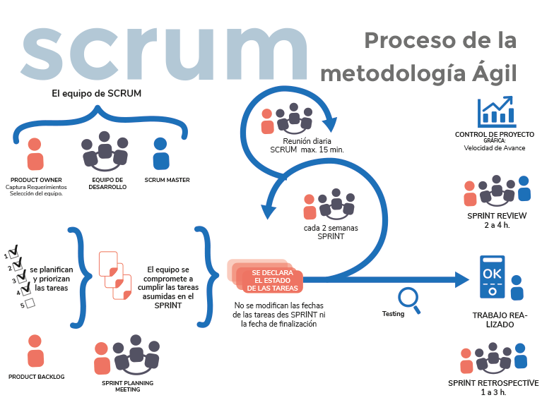

*Ilustración 17*. Gráfico explicativo del proceso Scrum.

#### 1.5.10.1. Fases de una iteración

* **Planificación de la iteración** (***Sprint Planning***): Al iniciar cada iteración, un equipo multifuncional selecciona los requisitos del cliente de una lista priorizada (***ProductBackLog***) y propone los requisitos más prioritarios a desarrollar en ella y se comprometen a terminar los elementos al final de la iteración. En el transcurso de la iteración no se pueden cambiar los elementos elegidos.

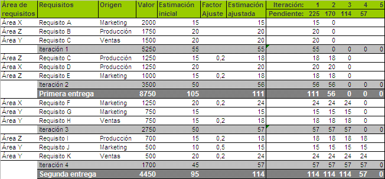

*Ilustración 18*. Tabla que nos permite organizar la planificación de cada _sprint_ o iteración 

El equipo planifica la iteración, define las tareas necesarias para poder completar cada requisito, creando la lista de tareas de la iteración (***Sprint Backlog***). El equipo decide a cuanto trabajo se compromete en vez de serles asignado. Esto hace que el compromiso sea más fiable porque el equipo lo está haciendo basado en su propio análisis y planificación.

*Ilustración 19*. Cómo pasar del _Producto backlog_ al _Sprint backlog_ y la división en tareas

* **Ejecución de la iteración** (***Sprint***): Todos los días el equipo se reúne brevemente para informar del progreso, y actualizan unas gráficas sencillas que les orientan sobre el trabajo restante. Cada miembro del equipo debe responder las siguientes preguntas:
    * ¿Qué he hecho desde la última reunión de sincronización? ¿Pude hacer todo lo que tenía planeado? ¿Cuál fue el problema?
    * ¿Qué voy a hacer a partir de este momento?
    * ¿Qué impedimentos tengo o voy a tener para cumplir mis compromisos en esta iteración y en el proyecto?

* **El tablero de tareas** (***Scrum Taskboard***): La lista de objetivos a completar en la iteración también se puede gestionar mediante un tablón de tareas (_scrum taskboard_). Al lado de cada objetivo se ponen las tareas necesarias para completarlo usando _post-its_, y se van moviendo hacia la derecha para cambiarlas de estado (pendientes de iniciar, en progreso, hechas). Para cada miembro del equipo se puede utilizar adhesivos de colores más pequeños sobre cada tarea, de manera que se pueda ver en qué tareas está trabajando cada cual. También podemos crearlo digitalmente; una de las herramientas gratuítas para hacerlo es trello [https://trello.com/](https://trello.com/).

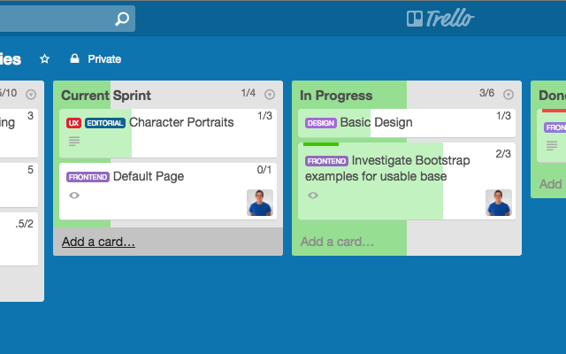

*Ilustración 20*. Creación de un tablero de tareas usando la herramienta Trello.

* **Demostración de requisitos completados** (***Sprint Demonstration***): Al final del sprint, el equipo revisa el sprint con los interesados en el proyecto, y les enseña lo que han construido y los requisitos completados. La gente obtiene comentarios y observaciones que se puede incorporar al siguiente sprint. 
* **Retrospectiva de la iteración** (***Sprint Retrospective***): Es una oportunidad para que el equipo hable sobre lo que funciona y lo que no (no solo del producto que se está realizando, sino además de cómo se está llevando adelante el proceso), y acuerden qué cambios quieren intentar.

#### 1.5.10.2. Roles en un proyecto Scrum

Existen tres roles principales dentro de un proceso _Scrum_:

* **Cliente** (***Product Owner***): Es el representante de todas las personas interesadas en los resultados del proyecto o consumidores finales del producto y actúa como interlocutor único ante el equipo, con autoridad para tomar decisiones. Define los objetivos del producto o proyecto y crea y mantiene la lista priorizada con los requisitos necesarios para cubrir los objetivos del producto o proyecto, conoce el valor que aportará cada requisito y calcula el retorno de la inversión a partir del coste de cada requisito que le proporciona el equipo. Antes de iniciar cada iteración replanifica el proyecto en función de los requisitos que aportan más valor en ese momento, de los requisitos completados en la iteración anterior y del contexto del proyecto en ese momento

* **Facilitador** (***Scrum Master***): Lidera al equipo velando por que todos los participantes del proyecto sigan las reglas y proceso de Scrum, facilita las reuniones de Scrum (planificación de la iteración, reuniones diarias de sincronización del equipo, demostración, retrospectiva), de manera que sean productivas y consigan sus objetivos y se asegura que los requisitos se desarrollan con calidad.

* **Equipo** (***Team***): Es el grupo de personas que de manera conjunta desarrollan el producto del proyecto.

#### 1.5.10.3. Beneficios de usar Scrum

Como conclusión, podemos enumerar muchos de los beneficios de utilizar Scrum en un proyecto:

* El cliente fija sus expectativas al indicar el valor que le aporta cada requisito del proyecto y cuando espera que esté completado.
* El cliente podría utilizar los resultados más importantes del proyecto antes de que esté finalizado por completo.
* De manera regular el cliente puede redirigir el proyecto en según las nuevas prioridades, o según los cambios en el mercado.
* De manera regular, el cliente maximiza el retorno de la inversión del proyecto.
* Desde el comienzo el equipo tiene que gestionar los problemas que pueden aparecer en una entrega del proyecto de esta manera es posible resolverlas de manera anticipada.
* Los miembros del equipo sincronizan su trabajo diariamente esto ayuda a resolver que se puedan presentar a otros miembros del equipo durante la iteración.
* Las personas trabajan más enfocadas y de manera más eficiente cuando hay una fecha límite a corto plazo para entregar un resultado al que se han comprometido.
* La estimación de esfuerzo y la optimización de tareas para completar un requisito es mejor si la realizan las personas que van a desarrollar el requisito, dadas sus diferentes especializaciones, experiencias y puntos de vista.
* Los resultados y esfuerzos del proyecto se miden en forma de objetivos y requisitos entregados al negocio.
* Las personas están más motivadas cuando pueden usar su creatividad para resolver problemas y cuando pueden decidir organizar su trabajo.

Puedes profundizar más en el estudio de Scrum en la web Proyectos Ágiles (https://proyectosagiles.org/que-es-scrum/), que contiene amplios tutoriales y diccionarios de Scrum.

## 1.6. Bibliografía

* http://es.kioskea.net/contents/langages/langages.php3
* http://es.wikipedia.org/wiki/Lenguaje_de_programación 
* http://es.wikipedia.org/wiki/C%C3%B3digo_fuente 
* http://es.wikipedia.org/wiki/C%C3%B3digo_objeto 
* ÁLVAREZ SÁNCHEZ, J.R. y ARIAS CALLEJA, MANUEL: “Análisis, diseño y mantenimiento de Software”.
* http://www.ia.uned.es/ia/asignaturas/adms/GuiaDidADMS/index.html.
* RODRÍGUEZ BARRANCO, J.A.: “Metodología de Desarrollo Software. El modelo en V o de cuatro niveles”. Publicado en su blog personal: http://www.iiia.csic.es/udt/es/blog/jrodriguez/2008/metodologia-desarrollosotware-modelo-en-v-o-cuatro-niveles 
* Página web oficial de Métrica v3: http://administracionelectronica.gob.es/?_nfpb=true&_pageLabel=P600859012
74201580632&langPae=es
* https://es.wikipedia.org/wiki/Desarrollo_%C3%A1gil_de_software. 
* http://pomodorotechnique.com/.
* https://es.wikipedia.org/wiki/Scrum.
* https://proyectosagiles.org/que-es-scrum/.
* DÍAZ, A.: “Introducción a Scrum y por qué debes usarlo”. Publicado en su blog
personal: https://highscalability.wordpress.com/2010/01/24/introduccion-ascrum-y-por-que-debes-usarlo/. Consultado el 25 de septiembre de 2016

